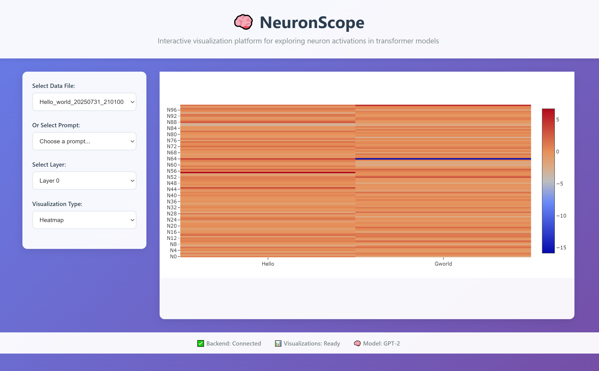
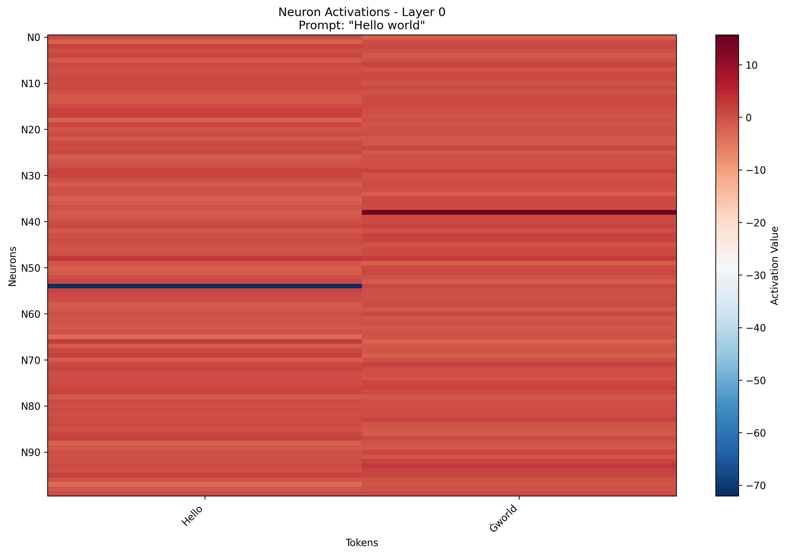
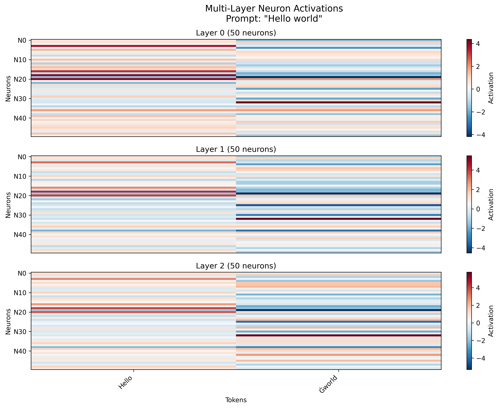
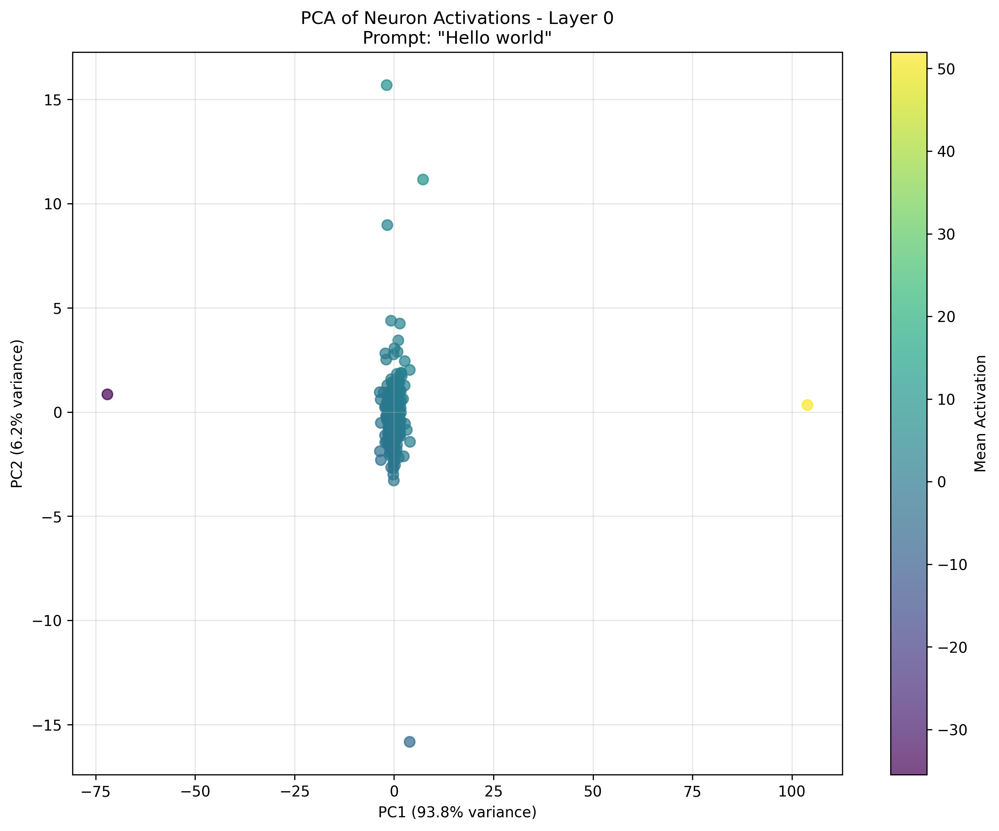
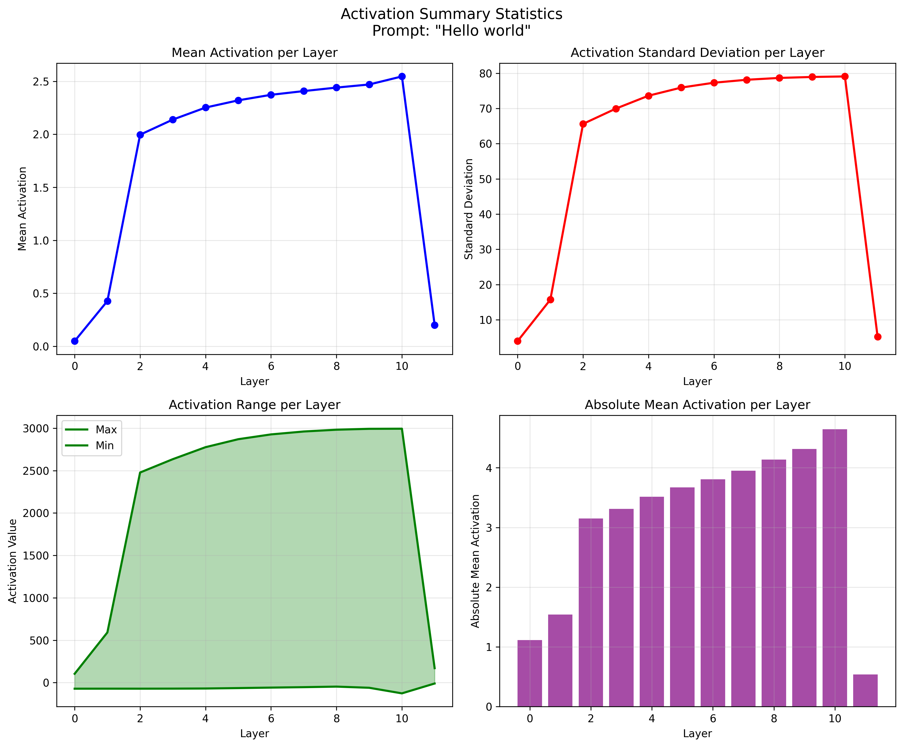
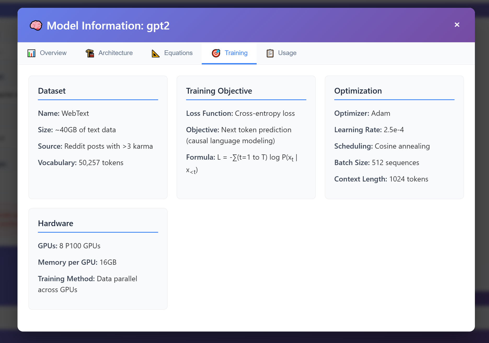

# NeuronScope

**NeuronScope** is an open-source research and visualization platform designed for exploring neuron activations inside transformer models (initially GPT-2, with support for LLaMA planned later). It aims to provide interactive, intuitive visual insights into how transformer model neurons activate, cluster, drift, and respond to various inputs.



## 🧠 Visualization Examples

### Heatmap Visualization

*Neuron activations across tokens in Layer 0 of GPT-2 for "Hello world"*

### Multi-Layer Comparison

*Neuron activations across multiple layers showing how patterns evolve*

### Scatter Plot Analysis

*PCA projection of neuron activations showing clustering patterns*

### Statistical Summary

*Statistical analysis of activation patterns across all layers*

### Model Statistics Modal

*Interactive modal showing detailed model statistics and neuron information*

## Project Objectives
- Offer detailed insight into transformer neuron behavior and patterns.
- Visualize neuron activations clearly, interactively, and meaningfully.
- Support researchers with a user-friendly, interactive web-based interface.
- Provide supplementary CLI tools for batch processing and automated analysis.

## Key Features (MVP)
- **Neuron Activation Visualization**
  - Generalized neuron activation heatmaps.
  - Interactive scatter plots and dimensionality reductions (e.g., PCA, t-SNE).
  - Polysemantic neuron detection and exploration.
- **Neuron Clustering**
  - Cluster neurons by activation similarity and visualize clearly.
  - Allow interactive exploration of neuron groups and clusters.
- **Reverse Activation Queries**
  - Identify tokens, bi-grams, or n-grams that strongly activate specific neurons or neuron clusters.
  - Interactive querying through intuitive UI.
- **Neuron Drift Analysis**
  - Static and animated visuals tracking neuron activations across model fine-tuning checkpoints.
  - Clearly visualize neuron evolution and drift patterns over time.

## 🚀 Current Status

**Phase 2 Complete!** NeuronScope now has a fully functional backend and interactive frontend:

### ✅ **Implemented Features**
- **GPT-2 Model Integration**: Load and extract activations from GPT-2 models
- **Static Visualizations**: Heatmaps, scatter plots, and statistical summaries
- **React Frontend**: Modern, responsive dashboard with interactive controls
- **Data Integration**: Load and visualize real activation data
- **Multi-Layer Analysis**: Explore activations across all 12 GPT-2 layers

### 🔄 **In Development**
- **Clustering Algorithms**: K-Means clustering of neurons
- **Reverse Activation Queries**: Find tokens that activate specific neurons
- **Advanced Visualizations**: Polysemantic neuron detection
- **Backend API**: HTTP API for real-time data generation

## Technology Stack
- **Backend/Core:** Python (PyTorch, NumPy, Pandas, scikit-learn)
- **Frontend/Web UI:** React with interactive plotting libraries (Plotly, D3.js)
- **Visualization:** Initial static visualizations, incrementally enhanced by animations.
- **Optional Optimization:** C or Cython only if substantial (>5x) performance gains identified.

## Quick Start

See [SETUP.md](SETUP.md) for detailed installation and setup instructions.

```bash
# Clone and setup
git clone <repository-url>
cd nscope
python3 -m venv venv
source venv/bin/activate

# Install Python dependencies
pip install -r requirements.txt

# Verify backend setup
python scripts/setup_models.py

# Extract sample activations
python scripts/extract_activations.py

# Start the React frontend
cd src/frontend
npm install
npm start
```

The application will be available at `http://localhost:3000`

## Project Workflow
- Start with GPT-2 for initial development and quick prototyping. LLaMA once things are stabalized.
- Implement a web-first UI/UX with minimal dependencies.
- Incrementally introduce advanced visualizations, animations, and additional model support (LLaMA, Mistral, etc.).

## Contributions & Collaboration
Initially, NeuronScope will be built for local, single-developer use. Contributions, Dockerization, comprehensive documentation, and more robust testing will follow after core MVP stabilization.

---

# Bibliography of Research Papers on Neuron Analysis in LLMs
 These are all interessting papers and were great resources for some of the NeuronScope features.

1. **The Geometry of Concepts: Sparse Autoencoder Feature Structure**  
   - **Authors**: OpenAI researchers  
   - **Organization**: OpenAI  
   - **Date**: 2025  
   - **Summary**: This paper explores sparse autoencoders (SAEs) to decompose neuron activations in LLMs into interpretable features, revealing the geometric structure of how neurons encode specific concepts like syntax or factual knowledge. It uses statistical methods to analyze the distribution and sparsity of features across neurons, identifying which neurons are most active for particular tasks. This is directly relevant to neuron statistical analysis, as it provides a framework for quantifying and visualizing neuron contributions, which could be integrated into a tool for mapping neuron activity to model behaviors.  
   - **Source**: Available on arXiv (https://arxiv.org).

2. **On the Biology of a Large Language Model: The Geometry of Claude 3.5 Haiku**  
   - **Authors**: Anthropic research team  
   - **Organization**: Anthropic  
   - **Date**: 2024  
   - **Summary**: This work draws parallels between LLM neurons and biological neural networks, using circuit tracing and SAEs to analyze neuron activity in Claude 3.5 Haiku. It quantifies how specific neurons contribute to behaviors like refusal mechanisms or multilingual processing through statistical analysis of activation patterns and feature attribution. The paper’s focus on circuit-level neuron interactions and statistical feature extraction is highly relevant for developing tools that visualize and quantify neuron contributions in LLMs.  
   - **Source**: Published on Anthropic’s Transformer Circuits (https://transformer-circuits.pub).

3. **Neuron-Level Knowledge Attribution in Large Language Models**  
   - **Authors**: Zeping Yu, et al.  
   - **Organization**: Independent researchers (not explicitly affiliated with a single institution)  
   - **Date**: 2024  
   - **Summary**: This paper introduces a neuron attribution algorithm to identify "knowledge neurons" in LLMs that encode specific factual associations, using statistical metrics like log probability increase and activation patching. It quantifies neuron importance through statistical analysis of activation changes during factual recall, offering methods to edit neurons for model updates. This is crucial for a neuron analysis tool, as it provides statistical techniques for pinpointing and manipulating knowledge-encoding neurons.  
   - **Source**: Available on arXiv and GitHub (https://github.com/zepingyu0512/neuron-attribution).

4. **Scaling Monosemanticity: Extracting Interpretable Features from Claude 3 Sonnet**  
   - **Authors**: Anthropic research team  
   - **Organization**: Anthropic  
   - **Date**: 2024  
   - **Summary**: This paper scales sparse autoencoders to extract monosemantic features from neuron activations in Claude 3 Sonnet, statistically analyzing how neurons encode safety, reasoning, or cultural knowledge. It uses statistical methods to quantify feature sparsity and neuron activation patterns across tasks, providing visualizations of neuron contributions. This is relevant for your tool, as it demonstrates scalable statistical approaches for neuron analysis in large LLMs, which could inform feature extraction and visualization functionalities.  
   - **Source**: Published on Anthropic’s research blog (https://www.anthropic.com).

5. **Toy Models of Superposition**  
   - **Authors**: Nelson Elhage, et al.  
   - **Organization**: Anthropic  
   - **Date**: 2023  
   - **Summary**: This paper examines superposition, where neurons in LLMs represent multiple features simultaneously, using toy Transformer models. It employs statistical analysis to quantify how neurons encode sparse or overlapping features, laying the groundwork for understanding neuron activity distributions. This is relevant for neuron statistical analysis, as it provides theoretical insights into disentangling neuron contributions, which could guide the development of tools for analyzing complex neuron interactions.  
   - **Source**: Available on Transformer Circuits (https://transformer-circuits.pub).

6. **Locating and Editing Factual Associations in GPT**  
   - **Authors**: Kevin Meng, et al.  
   - **Organization**: Independent researchers (originally MIT, updated 2024)  
   - **Date**: 2022 (updated 2024)  
   - **Summary**: This paper develops causal tracing to locate neurons in GPT models that encode factual associations, using statistical techniques to measure neuron activation changes during factual recall. It quantifies neuron contributions through activation patching and demonstrates neuron editing to modify model outputs. This is highly relevant for your tool, as it offers statistical methods for identifying and manipulating knowledge neurons, which could be a core feature for neuron analysis.  
   - **Source**: Available on arXiv and GitHub (https://github.com/kmeng01/rome).

7. **Probing for Linguistic Information in Transformer Representations**  
   - **Authors**: Fahim Dalvi, et al.  
   - **Organization**: Allen Institute for AI  
   - **Date**: 2023  
   - **Summary**: This paper uses probing classifiers to analyze how neurons in Transformer-based LLMs encode linguistic properties like syntax and semantics, employing statistical analysis to quantify neuron contributions to specific tasks. It provides visualizations of activation patterns using the NeuroX toolkit. This is relevant for your tool, as it demonstrates statistical probing and visualization techniques for neuron activity, which could enhance user-friendly analysis features.  
   - **Source**: Available via Allen Institute publications and NeuroX GitHub (https://github.com/fdalvi/NeuroX).

8. **The Clock and the Pizza: Two Stories in Mechanistic Explanation of Neural Networks**  
   - **Authors**: EleutherAI researchers  
   - **Organization**: EleutherAI  
   - **Date**: 2024  
   - **Summary**: This paper explores mechanistic interpretability through case studies, analyzing how neurons in models like Pythia encode temporal reasoning or contextual understanding. It uses statistical circuit analysis to quantify neuron activation patterns and their propagation through layers. This is relevant for your tool, as it provides practical examples of statistical neuron analysis in open-source models, which could inform accessible, task-specific analysis features.  
   - **Source**: Available on arXiv and EleutherAI’s GitHub (https://github.com/EleutherAI).